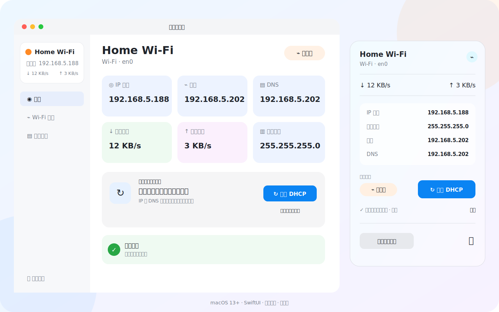

<div align="center">
  
  <h1>旁路由助手</h1>
  <p>在 macOS 菜单栏里，一键切换当前 Wi-Fi 的旁路由静态网络配置与 DHCP。</p>
</div>

## 它能做什么

当 Mac 需要通过旁路由联网时，通常要进入系统设置，手动填写 IP、子网掩码、网关和 DNS；离开这个网络后，又要逐项恢复 DHCP。旁路由助手把这套操作收成一次点击。

- 自动识别**当前连接的 Wi-Fi**，不绑定写死的网络名称。
- 一键启用旁路由：默认静态 IP `192.168.5.188`，网关和 DNS `192.168.5.202`。
- 一键恢复 DHCP，同时恢复自动 DNS。
- 菜单栏直接显示当前模式，并根据状态只提供一个明确的下一步操作。
- 展示当前 IP、子网掩码、网关、DNS、上传速度和下载速度。
- 可以为不同 SSID 保存独立配置，也可以设置连接后自动应用。
- 内置操作日志，记录检测、配置切换、失败原因和恢复过程。
- 支持 Spotlight 搜索，通过 `Command + Space` 输入“旁路由助手”启动。

## 界面预览



> 预览图使用示例 Wi-Fi 名称；实际界面会显示当前网络与真实配置。

## 使用方式

1. 启动应用后，它会常驻 macOS 菜单栏。
2. 首次使用时允许读取当前位置，以便 macOS 返回当前 Wi-Fi 名称。
3. 点击菜单栏图标查看当前网络状态。
4. 当前为 DHCP 时，选择“设置此 Wi-Fi”或“应用旁路由配置”。
5. 当前为旁路由时，选择“恢复 DHCP”。
6. 修改系统网络设置时，macOS 会请求管理员授权。

默认旁路由参数可以在保存前修改：

| 项目 | 默认值 |
| --- | --- |
| 静态 IP | `192.168.5.188` |
| 子网掩码 | `255.255.255.0` |
| 网关 | `192.168.5.202` |
| DNS | `192.168.5.202` |

## 从源码构建

要求：

- macOS 13 或更高版本
- Swift 6 / Xcode Command Line Tools

```bash
git clone https://github.com/Little-Mj/BypassRouterAssistant.git
cd BypassRouterAssistant
./build-app.sh
open "build/旁路由助手.app"
```

生成的应用位于 `build/旁路由助手.app`。如果需要长期使用，可以将它拖入 `/Applications`。

## 安全设计

网络切换属于高风险操作，因此项目没有把系统命令散落在界面代码中：

- 只有 `NetworkConfigurationService` 可以请求管理员授权。
- 参数在 Swift 层和管理员脚本中分别校验。
- 真正写入前再次核对 Wi-Fi 连接编号，防止授权期间切换网络后执行过期请求。
- 中途失败时尝试恢复切换前的 IP 和 DNS。
- 同一时间只允许一个切换任务。
- 应用同时使用 LaunchServices 限制和进程锁，避免多个实例并行修改网络。
- 日志默认保存在 `~/Library/Logs/旁路由助手/运行日志.log`，超过 2 MB 自动轮换。

应用不会上传网络配置，也不包含统计服务或远程服务器。

## 架构

```text
SwiftUI Views
    ↓ 用户操作 / 状态渲染
AppState（主线程编排）
    ├── NetworkPolicy                  纯决策与参数校验
    ├── ProfileRepository              Wi-Fi 配置持久化
    ├── AppLogStore                    有界日志存储
    ├── NetworkReader                  只读系统网络状态
    └── NetworkConfigurationService    唯一的特权写入边界
```

更完整的设计约束见 [ARCHITECTURE.md](ARCHITECTURE.md)，应用完整性检查见 [AUDIT.md](AUDIT.md)。

## 测试

```bash
swift test --disable-sandbox
```

当前自动化测试覆盖推荐操作判断、配置漂移、DHCP/DNS 状态、IPv4 与子网掩码校验，以及同一 SSID 的配置去重。

## 项目结构

```text
Sources/BypassRouter/
├── AppState.swift
├── NetworkPolicy.swift
├── NetworkConfigurationService.swift
├── NetworkServices.swift
├── ProfileRepository.swift
├── AppLogStore.swift
└── Views/
Resources/
├── network-helper.sh
├── Info.plist
└── AppIcon.icns
Tests/BypassRouterTests/
```

## 注意事项

- 切换 IP 配置时，当前网络连接可能短暂中断。
- “自动应用”仍受 macOS 管理员授权机制约束。
- 项目使用公开的 macOS 系统工具 `networksetup` 修改网络服务配置。
- 如果网关、DNS 或网段与默认值不同，请先为对应 Wi-Fi 保存自己的配置。

